# AWS CLI Infrastructure Lab

## 🔵 Objective
To demonstrate proficiency in managing AWS networking and compute resources using the AWS Command Line Interface (CLI).  
The focus of this lab is on **Elastic Network Interfaces (ENI), Placement Groups, and EC2 Instance Security Management**.

## 🔵 Core Capabilities Demonstrated

### 🔹Elastic Networking
Provisioning and configuring **secondary Elastic Network Interfaces (ENIs)** and associating them with **Elastic IP addresses (EIPs)** to create multi-homed EC2 instance setups.

### 🔹Network Security
Dynamically modifying **Security Group associations** at both the **network interface level** and **instance level**.

### 🔹Performance Optimization
Creating a **Cluster Placement Group** to achieve **low-latency and high-throughput networking** for distributed workloads.

### 🔹Instance Governance
Implementing **Termination Protection (Delete Protection)** to prevent accidental instance deletion.

## 🔵 AWS Services Used

. Amazon EC2 – Used to launch and manage virtual servers (t3.micro instance in Free Tier).

. Amazon VPC – Provided networking setup including subnets, security groups, and ENIs.

. Elastic IP (EIP) – Used to assign a static public IP for external access.

. Placement Groups – Used spread strategy to improve availability and fault tolerance.

. Security Groups – Controlled inbound/outbound traffic (SSH, HTTP, etc.).

. Network Interfaces (ENI) – Used primary and secondary interfaces for private and public traffic separation.

. AWS IAM – Provided permissions to execute AWS CLI commands securely via AWS CloudShell.

## 🔵 Assignment Structure

### 🔹 Phase 1 – Networking Layer
Create and configure a **secondary ENI**, attach security groups, and assign a **static public IP (Elastic IP)**for external access.

### 🔹 Phase 2 – Compute Layer
Create a **Spread Placement Group** and launch an **EC2 instance inside the group** to simulate a high-performance environment while staying within free tier limits.

### 🔹 Phase 3 – Security & Lifecycle
Enable **Termination Protection** and dynamically update **Security Groups** to simulate real-world maintenance and governance scenarios.

## 🔵 Architecture Flow

🔹Network Setup  
Create ENI → Assign Security Group → Attach Elastic IP

🔹Compute Setup  
Create Placement Group → Launch EC2 Instance in Placement Group

🔹Management  
Enable Termination Protection → Update Security Groups

## 🔵 Implementation Steps

### 🔹Step 1 – Create a Secondary Elastic Network Interface

## Here’s a simple visual diagram showing how a secondary ENI attaches to an EC2 instance and interacts with your VPC:

          ┌───────────────────────────┐
          │        VPC: 10.0.0.0/16  │
          │                           │
          │   ┌───────────────┐       │
          │   │   Subnet A    │       │
          │   │ 10.0.1.0/24  │       │
          │   └───────────────┘       │
          │           │               │
          │           │               │
          │  ┌───────────────────┐   │
          │  │   EC2 Instance    │   │
          │  │  i-0abcdef123456  │   │
          │  │                   │   │
          │  │ Primary ENI (eth0)│◄─ Public/Private IP
          │  │ Secondary ENI     │◄─ Optional extra IP, separate security group
          │  │   (eth1)          │
          │  └───────────────────┘
          │
          │
          │  Internet Gateway / Elastic IP can attach to any ENI
          │
          └───────────────────────────┘

🔹 How it works

1. Primary ENI (eth0)
2. Secondary ENI (eth1)
3. Elastic IP / Internet Gateway

🔹 **What is a Secondary ENI?**

An **Elastic Network Interface (ENI)** is like a **network card** for your EC2 instance in AWS.

- Every EC2 instance comes with **one primary ENI** by default.  
- Normally, it has **one network cable** (the primary ENI) connecting it to the network.

🔹 **What this step does**

When you create a **secondary ENI**, it’s like **plugging in a second network cable**.

- Now the instance can **talk to different networks** at the same time.  
- It can have **multiple IP addresses** or connect to **different subnets**.  
- Useful for **traffic isolation, multi-network communication, or high availability**.

### 🔹Find Subnets Available in Your VPC

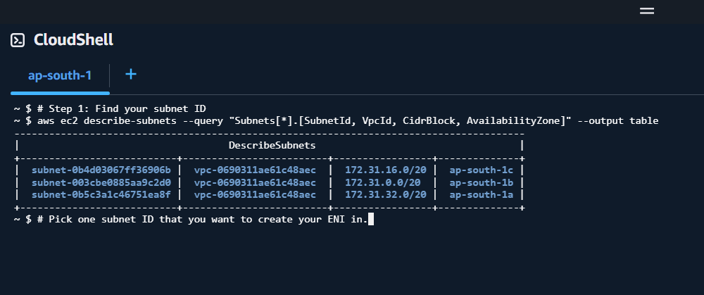

🔹 Pick one subnet ID that you want to create your ENI in.

🔹 **What happens after you run it**

1. AWS creates a **secondary ENI** in the subnet you specified.  
2. You will get a **JSON output** like this:

## json
{
    "NetworkInterface": {
        "NetworkInterfaceId": "eni-0d83541175ca081f2",
        "SubnetId": "subnet-12345abcde",
        "Description": "Secondary ENI for Assignment",
        ...
    }
}

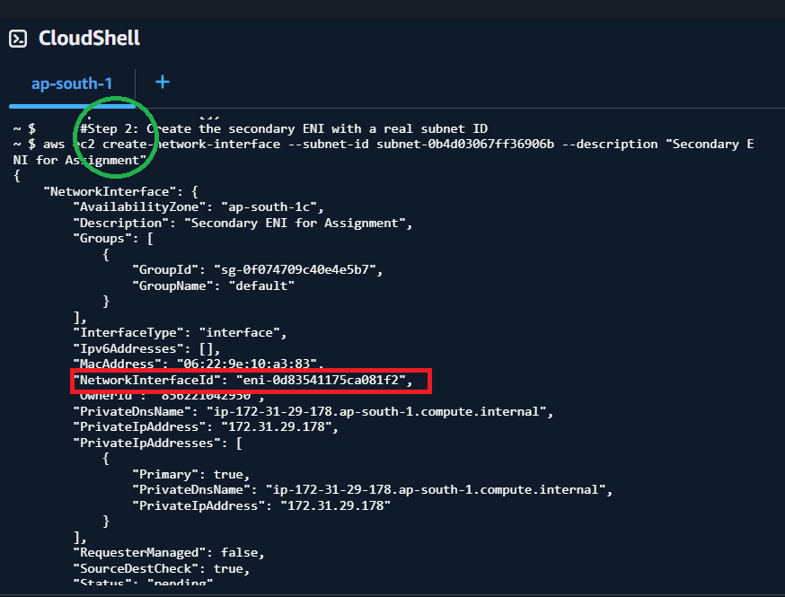

- The key thing to note is that the command returns JSON output containing the NetworkInterfaceId (eni-0a1b2c3d4e5f).

- You’ll use this ID in the next steps to attach it to your instance, assign security groups, or associate an Elastic IP.

🔹 Why it’s useful

- Allows multiple IPs per instance.

- Enables high availability setups or multi-network connectivity.

- Useful for applications that need separate public/private IPs or security isolation.

🔹 Why You Might Need This (Requirements / Use Cases)

1. Multiple IPs on One Instance

. Some apps need more than one IP.

. Example: A web server that serves two different domains with different public IPs.

2. Separate Security Groups / Traffic Isolation

. You can attach a different security group to the secondary ENI.

. Example: One interface for internal communication, another for public traffic.

3. High Availability / Failover

. You can move the ENI to another EC2 instance if one fails.

. Example: Critical services need minimal downtime.

4. Multi-Subnet or Multi-VPC Communication

. Secondary ENIs can be in a different subnet.

. Example: One ENI talks to your private database subnet, another to the public internet.

5. Elastic IP Assignment

. You can assign a separate public IP to this ENI without touching the primary one.

. Example: External clients use a dedicated public IP to reach the app.

🔹 TL;DR (Simple Summary)

. What: Add a “second network cable” to your instance.

. Why: To separate traffic, add more IPs, increase availability, or isolate security.

. Requirement: Any scenario where one network interface is not enough.

💡 Example Use Case You Might Relate To

Imagine you have a web server that:

. Needs one IP for the public website

. Needs another IP to talk securely to your database

. Needs traffic isolation for security

Instead of creating two separate EC2 instances, you just attach a secondary ENI with its own IP and security group. ✅

🔹Step 2 – Associate a Security Group with the ENI

After creating the Secondary Elastic Network Interface (ENI), the next step is to attach a Security Group to it.

A Security Group acts like a virtual firewall that controls incoming and outgoing traffic to your AWS resources.

Instead of protecting the entire instance, a Security Group attached to an ENI protects that specific network interface.

🔹Find Available Security Groups

Before associating a Security Group with the ENI, you need to find the Security Group ID available in your AWS account.

Run: aws ec2 describe-security-groups

output: {
  "SecurityGroups": [
    {
      "GroupName": "web-security-group",
      "GroupId": "sg-089cd5939a591ad7a",
      "Description": "Security group for web traffic"
    }
  ]
}

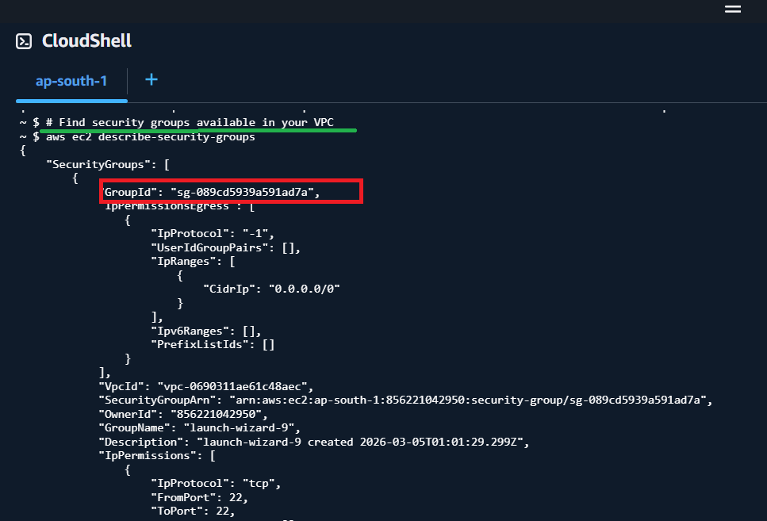

- The key thing to note is that the command returns JSON output containing the "GroupId": "sg-089cd5939a591ad7a"

- You’ll use this ID in the next steps.

🔹Associate the Security Group with the ENI

Run: aws modify-network-interface-attribute --network-interface-id eni-0d83541175ca081f2 --groups sg-089cd5939a591ad7a

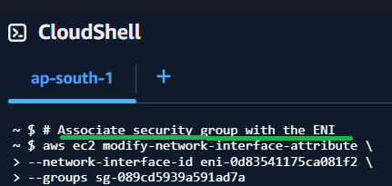

🔹 Run this command to confirm the security group is attached:

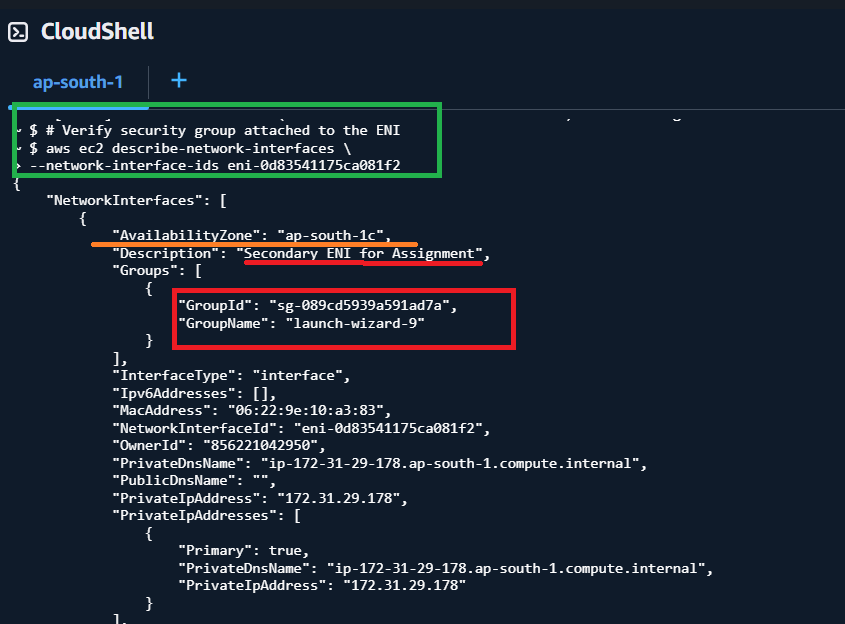

🔹 Show ENI and associated security groups (cleaner output)

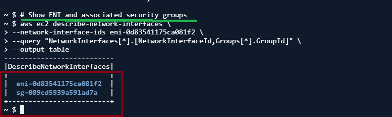

⚠️ Note:
This command replaces existing security groups with the one you specify.

🔹Example Firewall Rules for a Single-Product eCommerce Site

Security Groups control which traffic is allowed to reach your instance.

| Type                               | Protocol | Port(s)      | Source                    | Purpose                                    |
| ---------------------------------- | -------- | ------------ | ------------------------- | ------------------------------------------ |
| SSH (Admin access)                 | TCP      | 22           | Your IP only              | Secure server login for maintenance        |
| HTTP (Website traffic)             | TCP      | 80           | 0.0.0.0/0                 | Public access to the product page          |
| HTTPS (Secure website)             | TCP      | 443          | 0.0.0.0/0                 | Encrypted access for users                 |
| RDP (Optional, Windows admin)      | TCP      | 3389         | Your IP only              | Remote desktop access if server is Windows |
| Database (MySQL/PostgreSQL)        | TCP      | 3306 / 5432  | Private subnet only       | Only app server can access database        |
| Caching (Redis / Memcached)        | TCP      | 6379 / 11211 | Private subnet only       | Internal cache access for backend services |
| Internal API / Backend Services    | TCP      | 8080 / 5000  | Private subnet only       | Microservices or backend communication     |
| Monitoring / NTP / SNMP (Optional) | TCP/UDP  | 161 / 123    | Monitoring server IP only | Network monitoring and time sync           |
| Ping / ICMP (Optional)             | ICMP     | -            | Your IP only              | Test server connectivity                   |

This means:

. Only your IP can access SSH (and RDP if applicable).

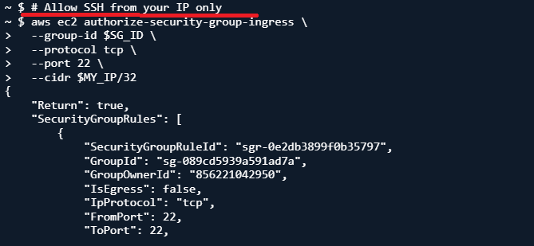

. Anyone on the internet can access HTTP/HTTPS.

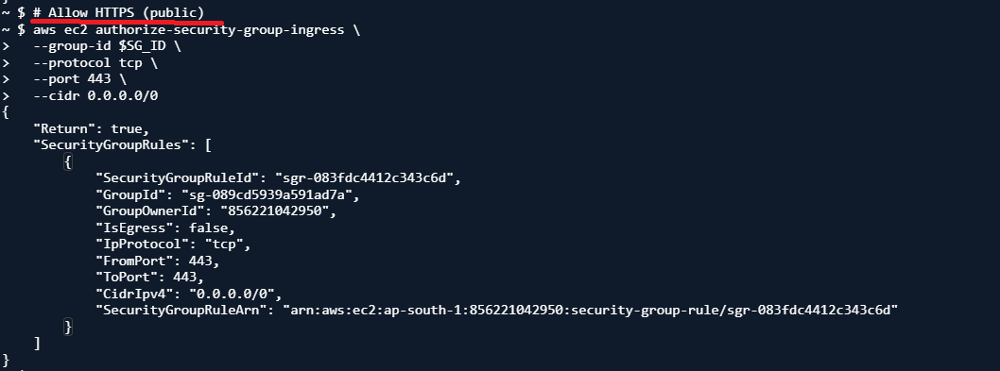

. All database, cache, and internal APIs are private-only.

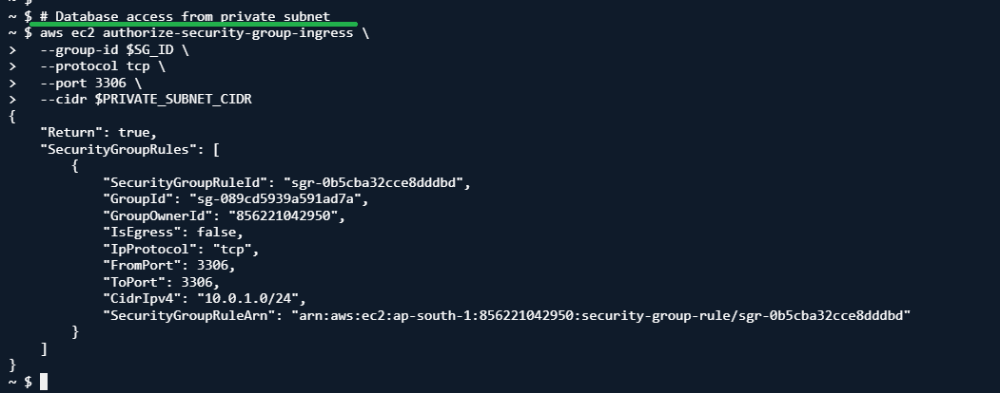

. Default deny all other traffic → secure by default.

.

🔹What Happens After Running the Command

1. AWS updates the Security Group attached to the ENI.

2. The ENI immediately starts using the new firewall rules.

3. Any traffic must follow the allowed ports defined in the security group.

🔹Why This Is Useful

. Traffic Isolation

. Each ENI can have its own Security Group.

. Example: Public web traffic on the primary ENI, internal services on the secondary ENI.

. Better Security

. Restrict SSH/RDP access to only trusted IPs.

. Keep databases, caching, and internal APIs private.

. Minimize exposure to the internet, reducing attack surface.

. Simplified Management

. Updating rules in a Security Group automatically applies to all attached ENIs.

. Easier to audit and maintain firewall rules for your platform.

. Flexible Architecture

. You can separate traffic by function (web, database, internal services).

. Supports scaling without compromising security.

. Compliance and Audit

. Clear, defined firewall rules help meet security standards.

. Makes it easier to demonstrate network-level protections.

🔹TL;DR

. What: Attach a Security Group (firewall rules) to your ENI.

. Why: To control and isolate traffic—public web access, secure admin access, and private backend services.

. Result:

- Public access allowed only for HTTP/HTTPS.

- Admin access (SSH/RDP) restricted to your IP.

- Database, cache, and internal APIs are private-only.

- All other traffic is blocked by default → stronger security.

  

🔹Step 3 – Allocate and Associate an Elastic IP

🔹What is an Elastic IP?

An Elastic IP (EIP) is a static public IP address provided by Amazon Web Services.

. Unlike normal public IPs, it does NOT change when the instance stops/starts.

. You can move it between resources (like ENIs or EC2 instances).

👉 Think of it as a permanent public phone number for your server.

🔹What This Step Does

In this step, you will:

. Allocate a new public IP (EIP)

. Attach it to your secondary ENI

✅ Result: Your ENI will now be reachable from the internet using a static IP

🔹Step 3.1 – Allocate an Elastic IP
🔹Run Command
aws ec2 allocate-address --domain vpc

🔹What Happens After Running This

AWS will return a JSON output like:

~ $ #step 1  Allocate an Elastic IP
~ $ aws ec2 allocate-address --domain vpc
{
    "AllocationId": "eipalloc-0c523dcdabfaad925",
    "PublicIpv4Pool": "amazon",
    "NetworkBorderGroup": "ap-south-1",
    "Domain": "vpc",
    "PublicIp": "13.205.200.49"
}
~ $ 

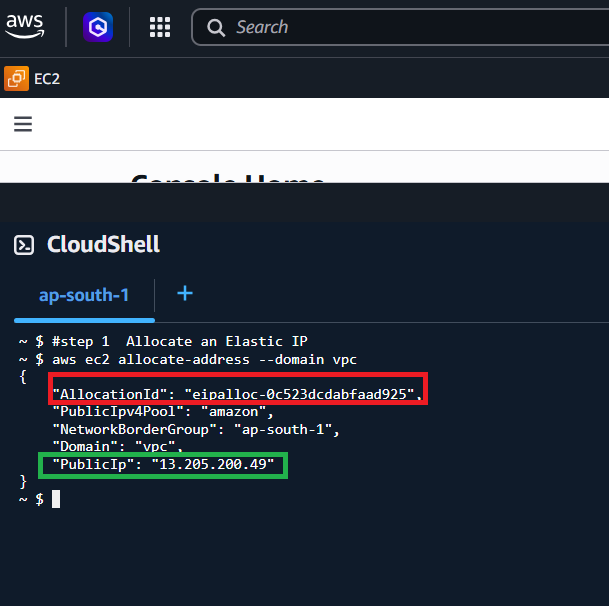

🔹Important Values

. PublicIp → Your new public IP

. AllocationId → 🔑 REQUIRED for next step

👉 Save this: 
"AllocationId": "eipalloc-0c523dcdabfaad925"

🔹Why Elastic IP Is Useful (Simple Explanation)

✅ 1. Static IP for your app/server

👉 Normally:

- When you stop/start an EC2 instance, its public IP changes

👉 With Elastic IP:

- Your IP stays the same forever

💡 Think of it like:

- Without EIP = changing phone number every day 📱❌

- With EIP = permanent phone number 📱✅

👉 So users always connect to the same IP
(no need to update anything)

✅ 2. Can remap quickly during failures

👉 If your server crashes:

- You launch a new EC2 instance

- Attach the same Elastic IP to it

⚡ Done in seconds!

💡 Think of it like:

- Your shop burns down 🏬🔥

- You move to a new building

- But keep the same phone number

👉 Customers don’t even notice the change

✅ 3. Required for production systems

👉 In real-world apps (websites, APIs, apps):

You NEED:

- Stable address

- No downtime

- Easy recovery

👉 Elastic IP helps you:

- Avoid breaking links

- Avoid DNS issues

- Maintain reliability

💡 Example:

- Your website is running on an EC2 instance

- If IP changes → site breaks ❌

- If using EIP → site always works ✅

🔹Super Simple Summary (TL;DR)

👉 Elastic IP = permanent public address

- Keeps your server reachable at the same IP

- Lets you switch servers without users noticing

- Makes your system stable and reliable

🔹Step 3.2 – Associate Elastic IP with Secondary ENI

Now attach the Elastic IP to your secondary ENI.

Run: 
aws ec2 associate-address \
  --allocation-id eipalloc-0c523dcdabfaad925 \
  --network-interface-id eni-0a92a6e517f06730a 

🔹Output:

AWS returns something like:
{
    "AssociationId": "eipassoc-06579a5f314ca9faa"
}
~ $ 

Key points after running command: 
- Your secondary ENI will get the Elastic IP.

- Any instance or service using that ENI will now be reachable via the public IP 13.205.200.49 (from your earlier allocation).

🔹What This Means

Your ENI now has a public static IP

Traffic from the internet can reach your ENI

The ENI acts like a public-facing network interface

 # Verify the Association
~ $ aws ec2 describe-addresses
{
    "Addresses": [
        {
            "AllocationId": "eipalloc-0c523dcdabfaad925",
            "AssociationId": "eipassoc-06579a5f314ca9faa",
            "Domain": "vpc",
            "NetworkInterfaceId": "eni-0a92a6e517f06730a",
            "NetworkInterfaceOwnerId": "856221042950",
            "PrivateIpAddress": "172.31.30.236",
            "PublicIpv4Pool": "amazon",
            "NetworkBorderGroup": "ap-south-1",
            "PublicIp": "13.205.200.49"
        }
    ]
}

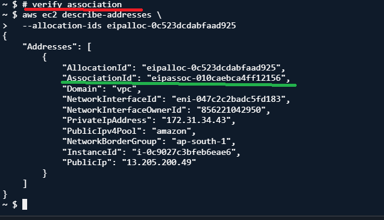

🔹Look for:

the key thing to look for to confirm the Elastic IP is correctly associated with your secondary ENI is:

1. NetworkInterfaceId → should match your secondary ENI:
"NetworkInterfaceId": "eni-0a92a6e517f06730a"

2. PublicIp → the Elastic IP you allocated:

"PublicIp": "13.205.200.49"

3. PrivateIpAddress → the private IP of that ENI:

"PrivateIpAddress": "172.31.30.236"

4. AssociationId → shows that the association exists:

"AssociationId": "eipassoc-06579a5f314ca9faa"

✅ If NetworkInterfaceId and PublicIp match what you expect, your Elastic IP is successfully associated with your secondary ENI.

🔹Updated Architecture (Now with Public IP)
updated architecture with the Elastic IP properly associated with your secondary ENI:

                   Internet
                       │
                       │
           Elastic IP: 13.205.200.49 (Static Public IP)
                       │
               ┌─────────────────┐
               │  Secondary ENI   │  ← Public Access Point
               │    (eth1)       │
               └─────────────────┘
                       │
               ┌─────────────────┐
               │   EC2 Instance  │
               │                 │
               │ Primary ENI     │  ← Private/Internal Traffic (eth0)
               │ Secondary ENI   │  ← Public Traffic (eth1 + EIP)
               └─────────────────┘

Explanation:

. Primary ENI (eth0): Handles private/internal traffic inside your VPC; no public exposure.

. Secondary ENI (eth1): Handles public traffic; it’s the interface with the Elastic IP attached.

. Elastic IP (13.205.200.49): Static IP that allows Internet access to your EC2 instance via the secondary ENI.

✅ You can now securely separate public and private traffic while maintaining a stable public IP for SSH, HTTP, HTTPS, or any other service you want to expose.

🔹Real-World Use Case

. Hosting a public-facing web server or API while keeping your main instance private.

. Using the secondary ENI as a “public gateway” for services that need Internet access without exposing your primary interface.

. Running multi-homed EC2 instances where internal traffic stays isolated from public traffic.

🔹Security Reminder ⚠️

. Only open ports on the secondary ENI that need public access (e.g., 22 for SSH from your IP, 80/443 for web).

. Keep your primary ENI private; avoid adding public rules to it.

. Monitor Elastic IP usage to prevent accidental public exposure of sensitive services.

. Consider enabling Security Groups and Network ACLs for fine-grained control.

🔹Common Mistakes to Avoid

. Associating the Elastic IP with the primary ENI by accident, exposing all internal traffic.

. Forgetting to update the security group to allow traffic to the secondary ENI.

. Allocating multiple Elastic IPs and losing track of which ENI they belong to.

. Attempting to SSH from an IP not allowed in the security group.

🔹TL;DR

. Secondary ENI + Elastic IP = public access point.

. Primary ENI remains private for internal VPC traffic.

. Verify with aws ec2 describe-addresses → check NetworkInterfaceId & PublicIp.

. Keep security groups tight: only expose required ports.

 

🔹Step 4 – Create Placement Group and Launch EC2
1️⃣ Create a Cluster Placement Group

A placement group lets you launch EC2 instances close together in a single Availability Zone. This is ideal for low-latency, high-bandwidth workloads like HPC or distributed databases.

Key Points:

- --strategy cluster ensures instances are physically close for low-latency communication.

- Placement groups are per AZ, so all instances must be in the same Availability Zone.

Run:
 aws ec2 create-placement-group \ > --group-name MyAssignmentCluster \ > --strategy cluster

Output: { "PlacementGroup": { "GroupName": "MyAssignmentCluster", "State": "available", "Strategy": "cluster", "GroupId": "pg-03874a2d8315cd8de", "GroupArn": "arn:aws:ec2:ap-south-1:856221042950:placement-group/MyAssignmentCluster" }}

Perfect ✅ — your cluster placement group MyAssignmentCluster is now created and in the available state.

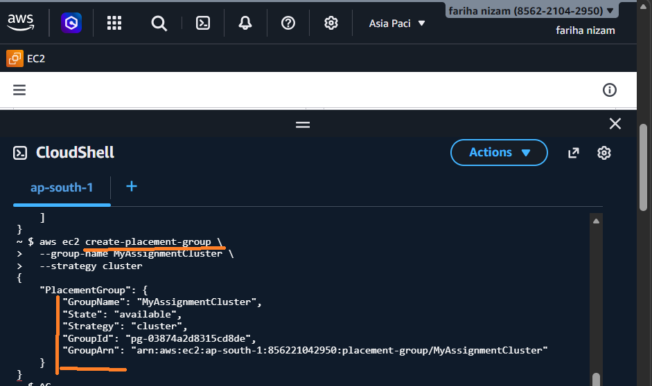

what each field means:

. GroupName → MyAssignmentCluster (your chosen name).

. State → available (ready to launch instances into it).

. Strategy → cluster (all instances in this group will be physically close for low-latency communication).

. GroupId → pg-03874a2d8315cd8de (unique ID for AWS API calls).

. GroupArn → full Amazon Resource Name for this placement group.

🔹Next Step – Launch an EC2 Instance in the Placement Group

🔹 Why I did NOT use Cluster Placement Group

- ❌ Not supported on t3.micro (Free Tier)

- ❌ Requires larger instance types (paid)

- ❌ Could lead to extra cost

- ✔ Used mainly for high performance (low latency)

1️⃣ List AMIs
For Amazon Linux 2 (common default)

Run: 
 $ # List AMIs
~ $ aws ec2 describe-images \
>   --owners amazon \
>   --filters "Name=name,Values=amzn2-ami-hvm-*-x86_64-gp2" \
>   --query "Images[*].[ImageId,Name]" \
>   --region ap-south-1 \
> --output table
----------------------------------------------------------------------
|                           DescribeImages                           |
+------------------------+-------------------------------------------+
|  ami-007e51e00fe1e2173 |  amzn2-ami-hvm-2.0.20260202.2-x86_64-gp2  |
|  ami-07e29570afffc72c1 |  amzn2-ami-hvm-2.0.20260302.0-x86_64-gp2  |
|  ami-092af1f88f4d39f02 |  amzn2-ami-hvm-2.0.20260105.1-x86_64-gp2  |
|  ami-0a289b56122fa70e8 |  amzn2-ami-hvm-2.0.20260120.1-x86_64-gp2  |
|  ami-0d16415f0e2dc4b80 |  amzn2-ami-hvm-2.0.20260216.0-x86_64-gp2  |
|  ami-0ee2c6b3de7f4eee7 |  amzn2-ami-hvm-2.0.20260109.1-x86_64-gp2  |
+------------------------+-------------------------------------------+
~ $ 

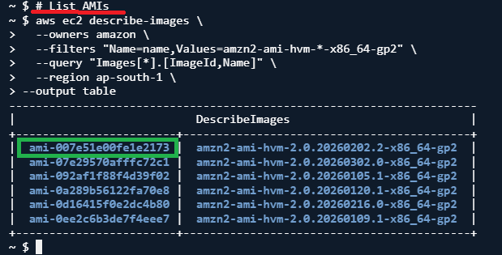

Pick the latest AMI ID (first column) ami-0123456789abcdef0 with it.

🔹 Option 1: Use a spread placement group (supports Free Tier t3.micro)

🔹 Why I USED Spread Placement Group

- ✅ Works with t3.micro (Free Tier)

- ✅ No extra cost

- ✅ Places instances on different hardware

- ✅ Gives better reliability / fault tolerance

- ✔ Good for safe and simple setups

1. Create a spread placement group:
Run: 
 $ # create spread placement group
~ $ aws ec2 create-placement-group \
>   --group-name MyAssignmentSpread \
>   --strategy spread
{
    "PlacementGroup": {
        "GroupName": "MyAssignmentSpread",
        "State": "available",
        "Strategy": "spread",
        "GroupId": "pg-07a381254f0097e46",
        "GroupArn": "arn:aws:ec2:ap-south-1:856221042950:placement-group/MyAssignmentSpread",
        "SpreadLevel": "rack"
    }
}

🔹 Perfect! ✅ Your spread placement group MyAssignmentSpread is now ready. You can launch your Free Tier-compatible instance (t3.micro) in it.

2. Launch your Free Tier instance in the spread placement group:

Run:
aws ec2 run-instances \
  --image-id ami-07e29570afffc72c1 \
  --count 1 \
  --instance-type t3.micro \
  --placement GroupName=MyAssignmentSpread \
  --security-group-ids sg-089cd5939a591ad7a \
  --key-name MyKeyPair

. The run-instances command returned a valid ReservationId:
"ReservationId": "r-065bf36cd8e35a9bf"

. Under Instances, it lists your instance with Architecture, Hypervisor, and NetworkInterfaces, even if the network interface is still “attaching”:

"NetworkInterfaces": [
    {
        "Attachment": {
            "Status": "attaching",
            ...
        },
        }
]

✅ So the EC2 instance exists in MyAssignmentSpread.

Perfect! ✅ Your Free Tier t3.micro instance has been launched in the spread placement group MyAssignmentSpread.

🔹Key points from the output:

. ReservationId: r-065bf36cd8e35a9bf → Your EC2 reservation.

. NetworkInterfaces → Shows the primary ENI (DeviceIndex: 0) attached automatically to the instance.

. Groups → Security group sg-089cd5939a591ad7a is applied.

. Status: attaching → The ENI is still in the process of being attached; once finished, it will say "attached".

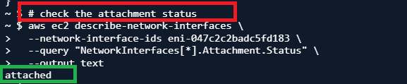

1. Instance still initializing: Sometimes the ENI stays in attaching until the instance transitions from pending → running. Check the instance state:

2. Check ENI Status Correctly
Run: 
~ $ aws ec2 describe-network-interfaces \
>   --network-interface-ids eni-0a92a6e517f06730a \
>   --query "NetworkInterfaces[*].Status" \
>   --output text
available
~ $ 

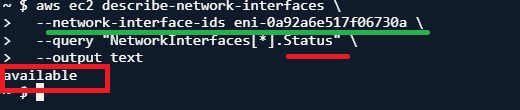

- available → Not attached to an instance.

- in-use → Attached to an instance.

- attaching → Currently in the process of attaching.

3. Understanding IDs

Network Interface ID (eni-xxxx) → This identifies the ENI itself. Example: eni-0a92a6e517f06730a.

Attachment ID (eni-attach-xxxx) → This identifies the attachment of an ENI to an instance, not the ENI itself. You cannot use this with describe-network-interfaces.

✅ For commands like describe-network-interfaces or associate-address, you must always use the Network Interface ID (eni-xxxx), not the attachment ID.

⚠️❗Remember!!!
network interfaces must be in the same Availability Zone as the instance to attach them.

. The only remaining step is to attach your secondary ENI (with Elastic IP) to it so that it becomes publicly accessible. The instance itself is already running in the spread placement group.

✅ Next Steps

Attach your secondary ENI with Elastic IP if you need public access.
Run:
aws ec2 attach-network-interface \
  --network-interface-id eni-047c2c2badc5fd183 \
  --instance-id i-0c9027c3bfeb6eae6 \
  --device-index 1

🔹After this, check the attachment status:

Run:
 $ # check the attachment status
~ $ aws ec2 describe-network-interfaces \
>   --network-interface-ids eni-047c2c2badc5fd183 \
>   --query "NetworkInterfaces[*].Attachment.Status" \
>   --output text
attached

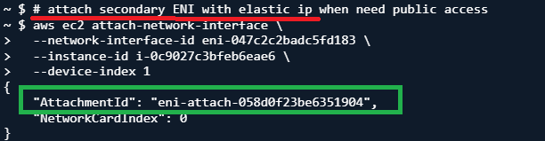

Perfect! ✅ Your secondary ENI eni-047c2c2badc5fd183 is now attached to your EC2 instance i-0c9027c3bfeb6eae6 as eth1 (device index 1).

🔹Next, you can associate your Elastic IP to make it publicly accessible. Run:

Run: 
aws ec2 associate-address \
  --allocation-id eipalloc-0c523dcdabfaad925 \
  --network-interface-id eni-047c2c2badc5fd183

Output:
{
    "AssociationId": "eipassoc-010caebca4ff12156"
}

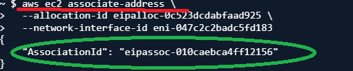

🔹After running that, verify the association:
Verify the Elastic IP association using aws ec2 describe-addresses.

Run:
aws ec2 describe-addresses \
  --allocation-ids eipalloc-0c523dcdabfaad925

Perfect! ✅

. Everything confirms that your public setup is working:

. NetworkInterfaceId: eni-047c2c2badc5fd183 → your secondary ENI

. InstanceId: i-0c9027c3bfeb6eae6 → your EC2 instance

. PrivateIpAddress: 172.31.34.43 → private IP of the secondary ENI

. PublicIp: 13.205.200.49 → Elastic IP now publicly reachable

. AssociationId: eipassoc-010caebca4ff12156 → shows the EIP is successfully associated

🔹💡 What this means:

. Your EC2 instance can now receive internet traffic via the secondary ENI and the Elastic IP.

. The primary ENI (eth0) still handles private/internal traffic inside your VPC.

🔹 One-line explanation (very important)

👉 “I chose spread placement group because it supports Free Tier and improves reliability, while cluster placement requires paid instance types and is mainly for performance.”

 

 🔹Step 5 – Enable or Disable Termination Protection

🔹Enable termination protection:

Run:
aws ec2 modify-instance-attribute \
  --instance-id i-0c9027c3bfeb6eae6 \
  --disable-api-termination "{\"Value\":true}"

This will prevent accidental termination of your instance.

🔹 You can check if termination protection is enabled by describing the instance attribute for disableApiTermination.

Run: 
aws ec2 describe-instance-attribute \
  --instance-id i-0c9027c3bfeb6eae6 \
  --attribute disableApiTermination

Output:
{
    "DisableApiTermination": {
        "Value": true
    },
    "InstanceId": "i-0c9027c3bfeb6eae6"
}

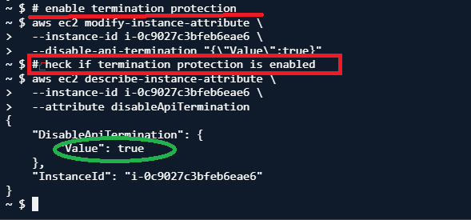

✅ If it shows "Value": true, termination protection is enabled.
✅ If "Value": false, it’s disabled.

🔹Disable termination protection:

Run:
aws ec2 modify-instance-attribute \
  --instance-id i-0c9027c3bfeb6eae6 \
  --disable-api-termination "{\"Value\":false}"

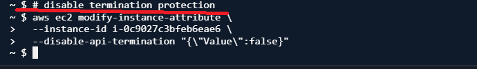

This allows normal termination again.

🔹Step 6 – Modify the Security Group of an EC2 Instance

🔹 Purpose: Change which security groups are applied to your EC2 instance. This affects what traffic (SSH, HTTP, etc.) is allowed.

🔹 Key Points:

. Only modifies the primary ENI (eth0) of the instance.

. You can attach one or more security groups.

. Changes take effect immediately—no need to restart the instance.

✅ Example: Replace the current security group with sg-newgroup.

1. Decide the Security Group(s) you want to attach

List your available security groups:

Run:
aws ec2 describe-security-groups \
  --query "SecurityGroups[*].[GroupId,GroupName]" \
  --output table

Output:
----------------------------------------------
|           DescribeSecurityGroups           |
+-----------------------+--------------------+
|  sg-0658bb0562be69d34 |  launch-wizard-14  |
|  sg-075da7032fcdb50f4 |  launch-wizard-1   |
|  sg-0deb8f17a6412d5bc |  launch-wizard-4   |
|  sg-00dda82e980102793 |  launch-wizard-6   |
|  sg-054789543116a584e |  launch-wizard-12  |
|  sg-0d63bbadd6f1ecc15 |  launch-wizard-10  |
|  sg-09c76b47ad0d13a61 |  launch-wizard-15  |
|  sg-0f074709c40e4e5b7 |  default           |
|  sg-008804b25055705d8 |  launch-wizard-20  |
|  sg-0c345baa7697a9a74 |  cli-sg1           |
|  sg-0221f7b0a6899c24c |  launch-wizard-5   |
|  sg-068e07afe83636a1e |  launch-wizard-18  |
|  sg-0c9b1f624c0ce7f6b |  launch-wizard-8   |

Great! Now you have the list of all security groups.

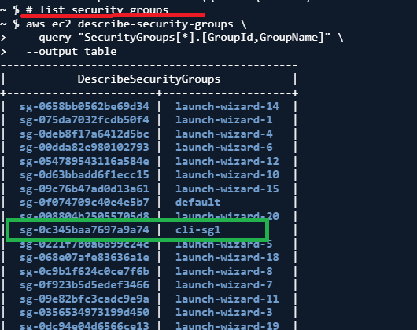

  Pick the GroupId of the security group you want to apply, e.g., sg-newgroupid.

Let’s say you want to replace your instance’s current security group with cli-sg1 (sg-0c345baa7697a9a74).

Run:
aws ec2 modify-network-interface-attribute \
  --network-interface-id eni-0d877d50df5ad88ca \
  --groups sg-0c345baa7697a9a74

🔹After running this, you can verify the change with:

  Run:
  aws ec2 describe-network-interfaces \
  --network-interface-ids eni-0d877d50df5ad88ca \
  --query "NetworkInterfaces[*].Groups[*].[GroupId,GroupName]" \
  --output table

Output:
-------------------------------------
|     DescribeNetworkInterfaces     |
+-----------------------+-----------+
|  sg-0c345baa7697a9a74 |  cli-sg1  |
+-----------------------+-----------+
~ $ 

✅ Success! The primary ENI (eni-0d877d50df5ad88ca) of your instance is now using the new security group cli-sg1 (sg-0c345baa7697a9a74).

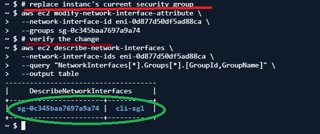

. Your instance will now follow the rules of this updated security group.

🔵 Project Folder Structure
aws-cli-infrastructure-lab/
│
├── README.md
│
├── scripts/
│   └── setup_resources.sh
│
├── screenshots/
│   ├── step1_eni.png
│   ├── step2_sg_assoc.png
│   ├── step3_eip.png
│   ├── step4_placement.png
│   ├── step5_protection.png
│   └── step6_change_sg.png
│

🔵 Key Outcomes

. Successfully provisioned secondary networking components.

. Implemented spread placement strategy for better availability.

. Applied instance governance and protection mechanisms.

. Practiced dynamic security group management using AWS CLI.

🔵 Conclusion

Successfully set up networking, compute, and security components using AWS CLI.

Used Free Tier resources efficiently without incurring extra cost.

Implemented spread placement group for better reliability and availability.

Gained hands-on experience with ENI, Elastic IP, Security Groups, and EC2 management.

Demonstrated real-world cloud practices like instance protection and secure access.

👉 Overall: Built a complete, cost-effective, and reliable AWS setup using best practices.

🔵 Post-Lab Cleanup (Important)

- Terminate EC2 instances to stop running resources and avoid charges.

- Disassociate and release Elastic IPs to free public IPs.

- Delete secondary ENIs to remove unused network interfaces.

- Delete placement groups once all instances are terminated.

- Remove custom security groups that were created for the lab.

- Verify cleanup by checking instances, ENIs, placement groups, security groups, and Elastic IPs.

## 🔹In AWS- a simplified breakdown of the dependency rules for lab cleanup:

🔹 Key Dependencies

. EC2 Instances → ENIs & EIPs

. You cannot delete a network interface (ENI) if it’s still attached to a running instance.

. You cannot release an Elastic IP (EIP) if it’s still associated with an ENI.

. Order to delete: Terminate instance → Disassociate EIP → Release EIP → Delete ENI.

. Placement Groups → EC2 Instances

. You cannot delete a placement group if it still has running instances in it.

. Order to delete: Terminate all instances in the placement group → Delete placement group.

. Security Groups → ENIs/Instances

. You cannot delete a security group if it’s still attached to a network interface or running instance.

. Order to delete: Detach or modify instances/ENIs to use another SG → Delete security group.

🔹 Safe Deletion Order (Post-Lab)

Terminate all EC2 instances.

Disassociate any Elastic IPs.

Release Elastic IPs.

Delete all secondary ENIs.

Delete the placement group.

Delete any custom security groups.

So yes, resources are interdependent, and AWS prevents deletion if something is still “in use.”